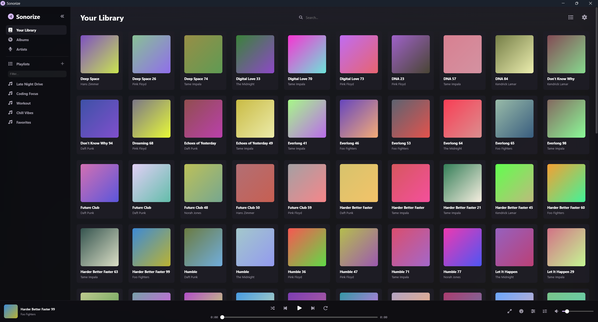

# 🎵 Sonorize

**Sonorize** is a modern, customizable desktop music player built with .NET 10 and Blazor Hybrid (Photino). It is designed to provide a clean, web-based interface for your local music library while offering native desktop performance and advanced audio controls.



> ⚠️ **Status: Experimental**
> 
> This project is in early development. It has currently **only been tested on Windows**. You may encounter bugs or incomplete features.

## ✨ Features

* **Local Library:** Scans folders to organize tracks by Artist, Album, and Duration.
* **Audio Engine:** Powered by **BASS**. Includes a 10-band Equalizer, plus Tempo (Speed) and Pitch controls.
* **Customization:** Robust theming engine. Change colors, layouts, or inject your own CSS.
* **Focus Mode:** A minimalist, distraction-free view for the currently playing track.
* **Metadata Editor:** Edit tags (Title, Artist, Album, etc.) directly within the app.
* **Last.fm:** Built-in real-time scrobbling.
* **Drag & Drop:** Drag files directly onto the window to play them instantly.

## 🛠️ Tech Stack

* **.NET 10**
* **Photino.Blazor** (Lightweight cross-platform desktop wrapper)
* **ManagedBass** (C# wrapper for the Un4seen BASS audio library)
* **Inflatable.Lastfm** (Scrobbling API)

## 🚀 Getting Started

### 1. Prerequisites

* Install the **.NET 10 SDK**.

### 2. Clone the Repository

```bash
git clone https://github.com/yourusername/sonorize.git
cd sonorize
```

### 3. Setup Audio Dependencies (BASS)

Sonorize requires `bass.dll` and `bass_fx.dll`.

* The application includes logic to check for these files. If they are missing at runtime, the app will show a popup with download links.
* For development, ensure these DLLs are present in your output directory (e.g., next to `Sonorize.exe`).

### 4. Enable Scrobbling (Optional)

The source code does not include API keys. To enable Last.fm features when building from source:

1. Navigate to `Sonorize.Core/Configuration/`.
2. Create a new file named `Secrets.Private.cs`.
3. Paste the following code, replacing the placeholders with your own Last.fm API credentials:

```csharp
namespace Sonorize.Core.Configuration;

public static partial class Secrets
{
    static partial void InjectLastFmKeys(ref string apiKey, ref string apiSecret)
    {
        apiKey = "YOUR_API_KEY";
        apiSecret = "YOUR_SHARED_SECRET";
    }
}
```

*If you skip this step, the app will run normally, but Scrobbling will be disabled.*

### 5. Run

```bash
dotnet run --project Sonorize.Photino.Blazor
```

## 🤝 Contributing

Contributions are very welcome!

 Since this project is experimental, bug reports and feature suggestions are highly appreciated. If you attempt to run this on **macOS** or **Linux**, please share your experience in the issues tab to help us improve cross-platform support.

#### 📄 License

The source code for **Sonorize** is licensed under the **MIT License**.

**Important Notes Regarding Third-Party Dependencies:**

1. **BASS Audio Library**
   
   - This project relies on the **BASS** audio library (Un4seen Developments) for playback.
   
   - **BASS** is free for **non-commercial** use.
   
   - Commercial use requires obtaining a separate license from Un4seen Developments.
   
   - For the most current and complete licensing terms, please refer to the official BASS website.

2. **SixLabors.ImageSharp**
   
   - This project uses **ImageSharp** for album art processing.
   
   - ImageSharp is licensed under the **Six Labors Split License**, which provides **Apache 2.0 terms for open-source use** and **commercial licensing options for certain proprietary or high-revenue scenarios**.
   
   - ImageSharp is free for use in this open-source project, but commercial forks—especially those with annual gross revenue exceeding $1M USD—may require a commercial license.
   
   - For the most current and complete licensing terms, please refer to the official Six Labors licensing documentation.

> **Disclaimer:**  
> Sonorize includes third-party libraries that are licensed separately by their respective authors.  
> The Sonorize project and its contributors do **not** own these libraries and cannot grant or validate licenses for them.  
> Users are responsible for ensuring compliance with all third-party licensing requirements when using, modifying, or distributing this software.
